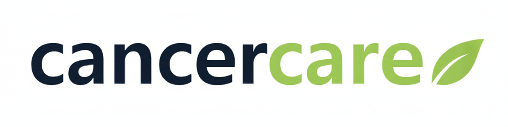

# CancerCare

> AI로 당신의 건강을 예측하고 챗봇으로 당신의 일상을 함께하는, 가장 스마트한 건강 동반자

## ✨ 소개 (Introduction)

CancerCare는 CNN 딥러닝 기반의 암 예측과 AI 챗봇을 통해 환자별 맞춤 상담, 식단 및 주변 병원 정보를 제공하는 지능형 헬스케어 플랫폼입니다. 복잡하고 흩어져 있는 의료 정보를 하나로 모아, 암 환자분들의 막막한 여정에 든든한 길잡이가 되어 드립니다.

## 🚀 주요 기능 (Features)

* **🔬 AI 암 예측**: CNN 딥러닝 모델인 YOLO V8을 사용하여 의료 이미지를 기반으로 암 발병 가능성을 예측합니다.
* **💬 AI 챗봇 상담**: 생활 습관, 식단, 일반적인 궁금증에 대해 24시간 맞춤형 상담을 제공합니다.
* **🥗 맞춤 식단 추천**: 환자의 상태를 고려한 건강하고 균형 잡힌 식단을 추천합니다.
* **🏥 주변 병원 찾기**: Kakao Map API를 활용하여 현재 위치를 기준으로 가장 가까운 병원을 안내합니다.

### 🛠️ 기술 스택 (Tech Stack)

#### **Backend**

#### **Frontend**

#### **AI / ML**

#### **Database / Cache**

#### **빌드 & 배포 도구 (Build & Deployment)**

#### **외부 API (External APIs)**

#### **개발 도구 (Development Tools)**

#### **협업/커뮤니케이션 (Collaboration/Communication)**

** 역할 분담
| 팀원 (Team Member) | 역할 (Role) | 주요 담당 기능 (Responsibilities) |
| --- | --- | --- |
| [**유승주**](https://github.com/pheonixpark) | PM, AI/ML Lead | - CNN/YOLOv8 기반 암 예측 모델 개발 - 프로젝트 총괄 및 관리 |
| [**민경준**](https://github.com/minkj98) | PL, AI Chatbot Lead | - Gemini API 연동 챗봇 기능 구현 - 프로젝트 개발 총괄 |
| [**박지선**](https://github.com/username) | Backend Developer | - Spring Security 기반 로그인/회원가입 구현 - 식단 추천 기능 구현 |
| [**이민우**](https://github.com/LeeMinWoo98) | Backend Developer | - Kakao Map API 연동 주변 병원 추천 구현 - 식단 추천 기능 구현 |

