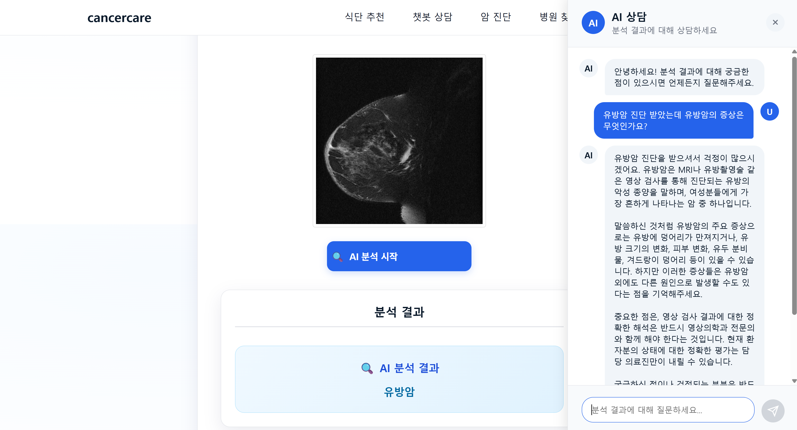
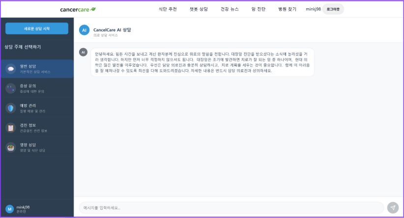
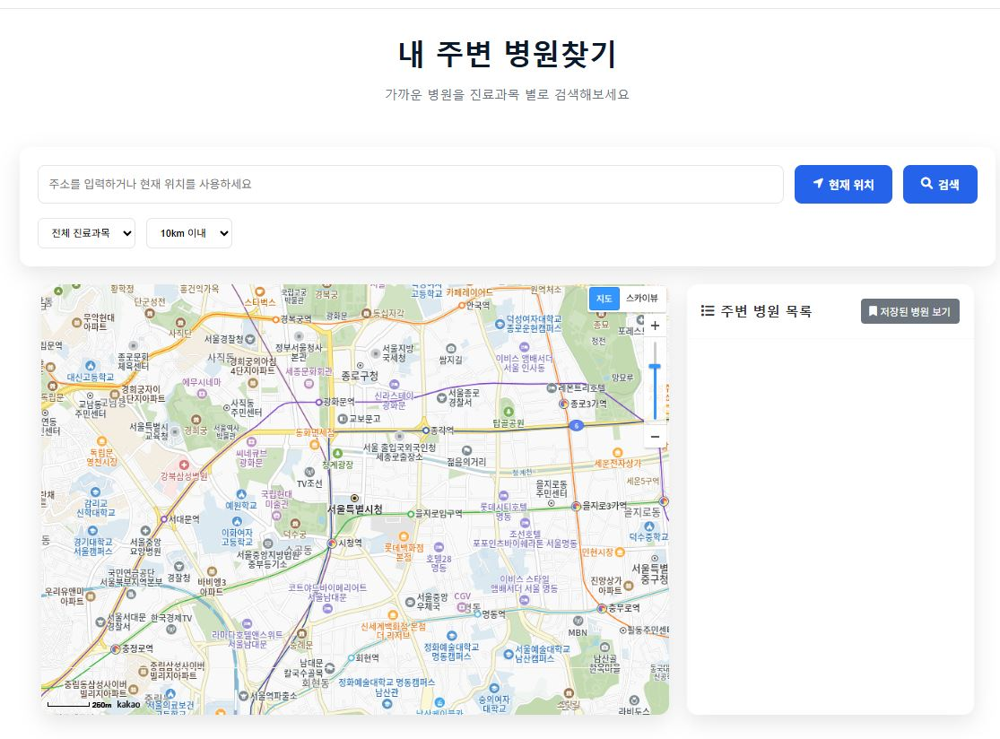

> "AI로 당신의 건강을 예측하고 챗봇으로 당신의 일상을 함께하는, 가장 스마트한 건강 동반자"

## ✨ 프로젝트 소개 (Introduction)
CancerCare는 CNN 딥러닝 기반의 암 예측과 AI 챗봇을 통해 환자별 맞춤 상담, 식단 및 주변 병원 정보를 제공하는 지능형 헬스케어 플랫폼입니다. 복잡하고 흩어져 있는 의료 정보를 하나로 모아, 암 환자분들의 막막한 여정에 든든한 길잡이가 되어 드립니다.

#### (1)프로젝트 기간
기간: 2025.08.11 ~ 2025.09.18(총 39일, 5주 4일)

## 🚀 추진 배경 및 기대효과
#### 추진 배경
- 고령화로 인한 암 발병률 증가: 65세 이상 인구가 늘면서 암 환자 수가 지속 상승하고, 조기 발견·지속 관리의 중요성이 커지고 있습니다.
- 의료 접근성 한계: 병원 방문에 따른 비용·시간 부담과 지역 격차로 적시에 의료 서비스를 이용하기 어려운 환경이 존재합니다.
- 전문의 부족·시스템 과부하: 암 전문의 수요 대비 공급 불균형으로 대기 시간이 길고, 의료 시스템 과부하로 효율적 진료 제공이 어렵습니다.
- 파편화된 암 관리: 진단, 상담, 생활관리, 병원 연계가 분절적으로 제공되어 환자 경험과 연속성이 저하됩니다.

#### 기대 효과
- 조기 발견율 향상: AI 기반 영상 분석으로 조기 진단을 지원해 치료 개입 시점을 앞당기고 생존율 제고에 기여합니다.
- 의료비 절감·효율 증대: 조기 발견으로 치료비를 낮추고, 불필요한 병원 방문을 줄여 시간·경제적 비용을 절약합니다.
- 개인 맞춤형 통합 케어: 진단부터 생활관리까지 원스톱 제공으로 편의를 높이고, 개인별 식단·습관 관리로 치료 효과를 증진합니다.
- 의료 접근성 개선: 지역 제약 없이 AI 상담을 제공하고, 위치 기반 병원 연계로 신속한 치료 연결을 돕습니다.

## 🚀 주요 기능 (Features)

* **🔬 AI 암 예측**: CNN 딥러닝 모델인 YOLO V8을 사용하여 의료 이미지를 기반으로 암 발병 가능성을 예측합니다.

* **💬 AI 챗봇 상담**: 생활 습관, 식단, 일반적인 궁금증에 대해 24시간 맞춤형 상담을 제공합니다.

* **🥗 맞춤 식단 추천**: 환자의 상태를 고려한 건강하고 균형 잡힌 식단을 추천합니다.

* **🏥 주변 병원 찾기**: Kakao Map API를 활용하여 현재 위치를 기준으로 가장 가까운 병원을 안내합니다.

### 🛠️ 기술 스택 (Tech Stack)

#### **Backend**

#### **Frontend**

#### **AI / ML**

#### **Database**

#### **인프라/클라우드(Infrastructure/Cloud)**

#### **빌드 도구 (Build Tool)**

#### **외부 API (External APIs)**

#### **개발 도구 (Development Tools)**

#### **협업/커뮤니케이션 (Collaboration/Communication)**

### **👨‍💻 팀원 소개 및 역할**
| 팀원 (Team Member) | 역할 (Role) | 주요 담당 기능 (Responsibilities) |
| --- | --- | --- |
| [**유승주**](https://github.com/pheonixpark) | PM, AI/ML Lead | - CNN/YOLOv8 기반 암 예측 모델 개발 - 프로젝트 총괄 및 관리 |
| [**민경준**](https://github.com/minkj98) | PL, AI Chatbot Lead | - Gemini API 연동 챗봇 기능 구현 - 프로젝트 개발 총괄 |
| [**박지선**](https://github.com/dodidosid) | Backend Developer | - Spring Security 기반 로그인/회원가입 구현 - 식단 추천 기능 구현 |
| [**이민우**](https://github.com/LeeMinWoo98) | Backend Developer | - Kakao Map API 연동 주변 병원 추천 구현 - 식단 추천 기능 구현 |

